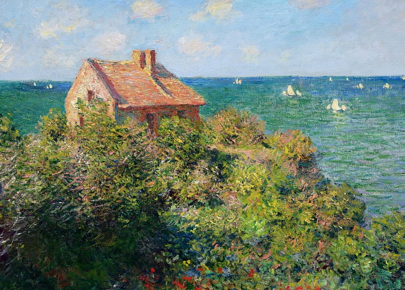
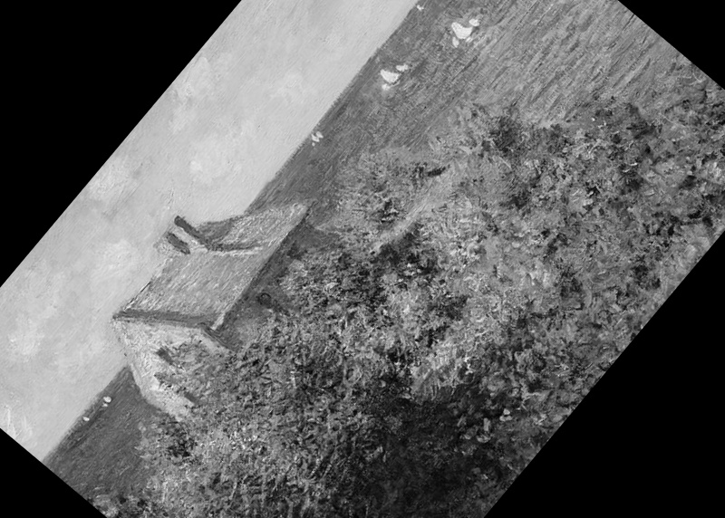
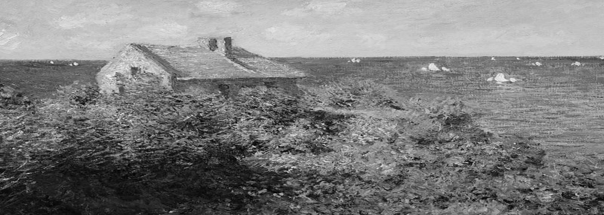
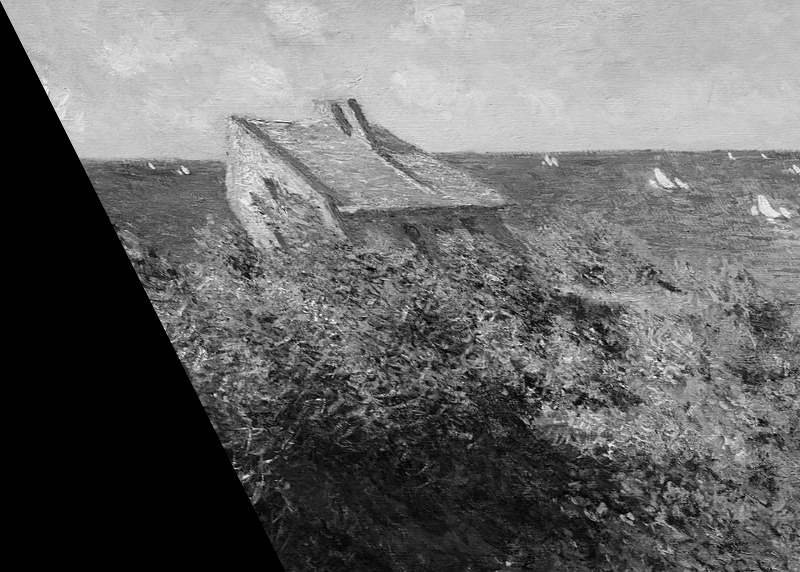
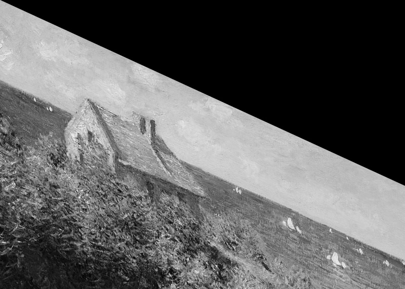
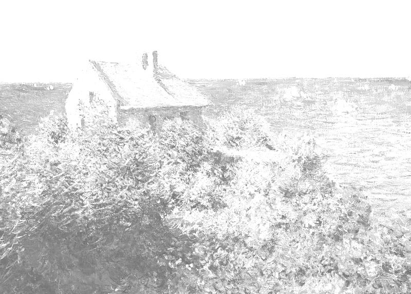
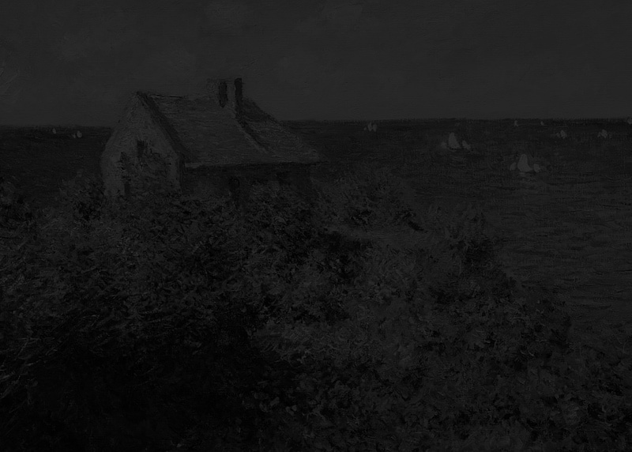
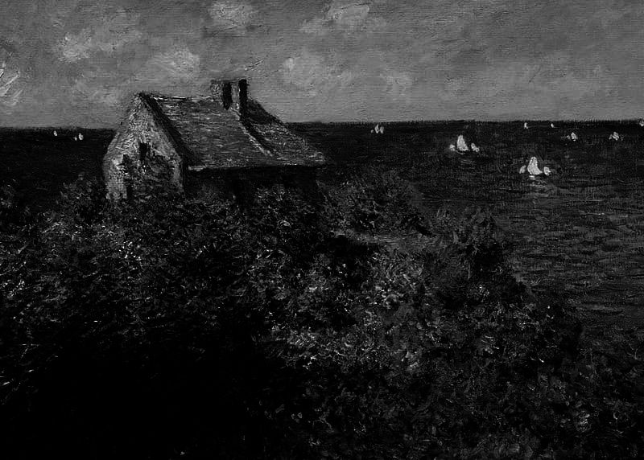
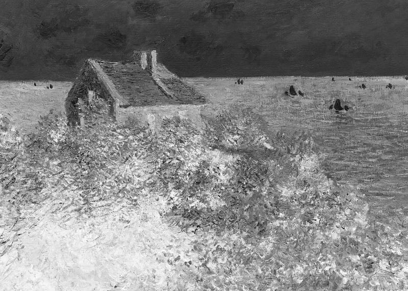

# 🖼️ Editor de Imagens - Processamento com OpenCV e Streamlit
👨‍💻 por **Diego de Dio Ferreira**

Este é um aplicativo desenvolvido com [Streamlit](https://streamlit.io/) e [OpenCV](https://opencv.org/) para aplicar transformações e ajustes em imagens, como rotação, redimensionamento, cisalhamento, brilho, contraste, correção gama e efeito negativo.

---

## 📸 Funcionalidades

O app permite que o usuário carregue uma imagem de duas formas:

- **Via Upload:** upload de arquivos `.jpg`, `.jpeg` ou `.png`.
- **Via Câmera:** captura diretamente pela webcam (se disponível no navegador).

Em seguida, é possível aplicar as seguintes transformações:

- **Rotação** da imagem em graus.
- **Redimensionamento horizontal e vertical** (escala de largura e altura).
- **Cisalhamento horizontal e vertical**.
- Ajuste de **brilho** e **contraste**.
- Aplicação de **correção gama**.
- Aplicação de **efeito negativo**.

A imagem editada pode ser visualizada lado a lado com a original e, ao final, **baixada em formato `.jpg`**.

---

## 🖼️ Exemplos de Imagens Editadas

Abaixo, alguns exemplos do que é possível fazer com o aplicativo:


| Imagem Original | Imagem Rotacionada |
|----------|---------|
|  |  |

| Imagem Original | Imagem Redimensionada na Horizontal |
|----------|---------|
|  |  |

| Imagem Original | Imagem Redimensionada na Vertical |
|----------|---------|
|  |  |

| Imagem Original | Imagem com Cisalhamento Horizontal |
|----------|---------|
|  |  |

| Imagem Original | Imagem com Cisalhamento Vertical |
|----------|---------|
|  |  |

| Imagem Original | Imagem com Brilho Modificado |
|----------|---------|
|  |  |

| Imagem Original | Imagem com Contraste Modificado |
|----------|---------|
|  |  |

| Imagem Original | Imagem com Gama Modificado |
|----------|---------|
|  |  |

| Imagem Original | Imagem com Efeito Negativo |
|----------|---------|
|  |  |

---

## 🖥️ Como rodar localmente

### ✅ Pré-requisitos

- Python 3.8 ou superior
- `pip` ou `conda`

### 🔧 Instalação

1. Clone este repositório ou salve o código principal em um arquivo chamado `app.py`.

2. Crie um ambiente virtual (opcional, mas recomendado):

   ```bash
   python -m venv venv
   source venv/bin/activate  # Linux/Mac
   venv\Scripts\activate     # Windows
   ```

3. Instale as dependências com o comando:

   ```bash
   pip install -r requirements.txt
   ```

   > **Exemplo de `requirements.txt`:**

   ```
   streamlit
   opencv-python
   pillow
   numpy
   ```

4. Rode o aplicativo:

   ```bash
   streamlit run app.py
   ```

5. Acesse no navegador:

   ```
   http://localhost:8501
   ```

---

## 📂 Estrutura do Código

O arquivo principal `app.py` contém:

- Configuração da página
- Carregamento da imagem
- Funções para transformação com OpenCV
- Sliders e botões interativos com `Streamlit`
- Seção para download da imagem processada

---

## 📌 Observações

- A função `camera_input` pode não estar disponível em todos os navegadores. O Google Chrome é recomendado.
- O modo de cinza (`convert('L')`) é aplicado após o upload, o que facilita algumas operações com brilho, contraste e gama.
- O cisalhamento é feito com `warpPerspective`, com matriz de transformação 3x3.

---

## 🚀 Melhorias Futuras

- Adição de filtros (blur, sharp, etc.)
- Ferramentas de corte e rotação livre
- Salvar imagem em outros formatos, como PNG ou BMP
- Salvar/carregar os valores das modificações em JSON. 

---

## 🧑‍💻 Autor

Desenvolvido por Diego de Dio Ferreira
